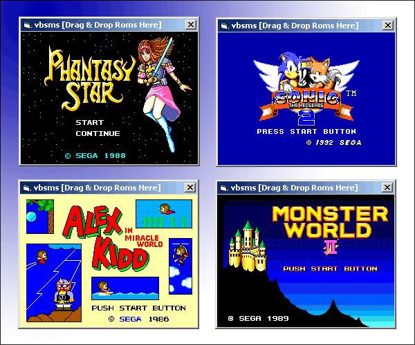



## Sega Master System / Game Gear Emulator SMS

### Description

Emulates the Sega Master System (95%) and Sega Game Gear (60%), no sound support yet, hopefully someone else will implement that!
 
### More Info
 

             |
---                |---
**Submitted On**   |2006-07-12 22:46:46
**By**             |[John Casey](https://github.com/Planet-Source-Code/PSCIndex/blob/master/ByAuthor/john-casey.md)
**Level**          |Advanced
**User Rating**    |5.0 (15 globes from 3 users)
**Compatibility**  |VB 5\.0, VB 6\.0
**Category**       |[Games](https://github.com/Planet-Source-Code/PSCIndex/blob/master/ByCategory/games__1-38.md)
**World**          |[Visual Basic](https://github.com/Planet-Source-Code/PSCIndex/blob/master/ByWorld/visual-basic.md)
**Archive File**   |[Sega\_Maste2005997122006\.zip](https://github.com/Planet-Source-Code/john-casey-sega-master-system-game-gear-emulator-sms__1-65907/archive/master.zip)

